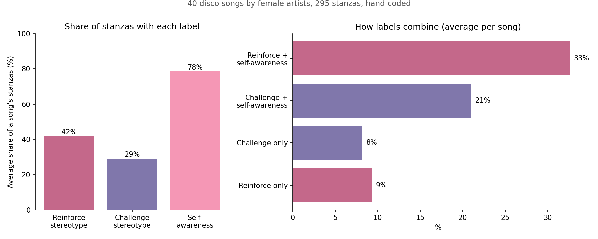

# Disco Lyrics and Gender Stereotypes: Do Female Disco Singers Challenge or Reinforce Gender Norms?

A course project (Fall 2024). I read 40 disco songs by female artists stanza by stanza and coded each stanza as reinforcing gender stereotypes, challenging them, showing self-awareness, or a mix.


*Computed from the hand-coded annotations in `data/stanza_annotations.csv`.*

**In short**
- 40 disco songs by female artists, 295 stanzas, coded by hand as reinforcing stereotypes, challenging them, showing self-awareness, or a mix.
- Self-awareness appears in about 78% of a song's stanzas on average. Reinforcing (42%) is more common than challenging (29%).
- Disco lyrics are dual: they challenge gender norms and sometimes reinforce them, and self-awareness is how singers show agency either way.

## Problem
Disco grew out of Black and LGBTQ+ communities in 1970s New York clubs, and it is often dismissed as shallow. I wanted to know what its lyrics actually say about gender. Three questions:
1. Do the lyrics tend to challenge gender stereotypes?
2. How does self-awareness relate to challenging or reinforcing stereotypes?
3. What role does self-awareness play in disco?

## My role
I chose the songs, read and coded every stanza by hand, built the visualizations and wrote the paper. I used Claude Code as a coding assistant for the later cleanup.

## Data
- 40 songs from the Spotify playlist "Queens of Disco" (female disco singers), split into 295 stanzas.
- Each stanza has three labels (reinforce, challenge, self-awareness), which can overlap: `data/stanza_annotations.csv`.
- Lyrics are not published, because they are copyrighted. The annotation file has song, artist, year and my labels, but not the text. To rerun the text steps, supply your own lyrics (one `.txt` per song) and add a `Stanza Text` column.

## Tools
Python: NLTK (tokenizing, word frequency), TextBlob (polarity and subjectivity), pandas, Plotly, WordCloud, matplotlib.

## Process
1. Code each stanza by meaning, not by keyword, because a keyword rule misses context. One stanza can be both "reinforce" and "self-awareness". For example, a singer begging a lover to stay fits a stereotype of dependence, yet openly stating her needs is a form of self-awareness.
2. Count the share of each category per song, and normalize contributions within and across songs.
3. Track how categories change from the first stanza to the last in each song.
4. Run TextBlob sentiment (polarity, subjectivity) per stanza and compare it with the coded categories.
5. Per-song word-frequency notebooks are in `songs/` (40 files, one per song). The two summary notebooks are in `notebooks/`:
   - `data_visualization.ipynb`: category shares, per-song comparison, trends
   - `sentiment_analysis.ipynb`: sentiment by stanza

## Key insights
- Self-awareness is the largest category, about 78% of stanzas on average.
- Reinforce is more common than challenge (42% vs 29% of a song's stanzas). The most common combination is reinforce + self-awareness (33%), then challenge + self-awareness (21%).
- Two patterns: songs that move from reinforcing to challenging (Hot Stuff, where sentiment also shifts from negative to positive), and songs that hold both at once.
- Conclusion: disco lyrics show duality. Self-awareness is how singers show agency inside limited autonomy, whether they challenge a norm or accept it.


## Business impact
This is a course project with no deployment. What it shows is a small, careful qualitative coding workflow with a transparent label scheme, which is the same skill used for tagging customer comments or reviews.

## Challenges and learnings
- With 295 stanzas, hand coding was feasible and kept context, but it is subjective and I was the only coder. A second coder and an agreement score would make it stronger.
- Forty songs from one playlist is a small, curated sample, so the findings describe this playlist, not all of disco.
- TextBlob is a general-purpose English sentiment tool, not built for lyrics, so I treat its scores as a supporting view next to the hand coding.
- Because one stanza can carry several labels, shares do not add up to 100%, so I report combinations as well as single categories.

## Run it
```bash
pip install -r requirements.txt
jupyter lab notebooks/
```
The notebooks expect lyric text you provide yourself (see Data).

## License
Code and annotations: MIT. See `LICENSE`. Song lyrics belong to their rights holders and are not included.
